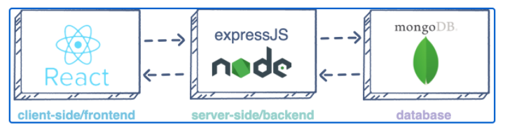
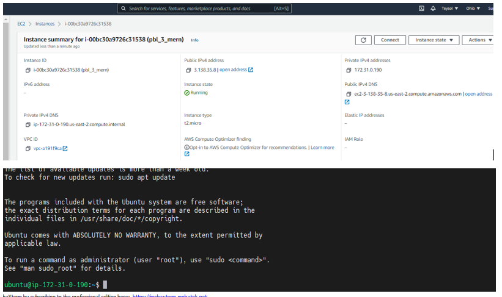

# MERN STACK IMPLEMENTATION

### MERN (MongoDB, ExpressJS, ReactJS, NodeJS)- It consists of following components:
- MongoDB: A document-based, No-SQL database used to store application data in a form of documents.
- ExpressJS: A server side Web Application framework for Node.js.
- ReactJS: A frontend framework developed by Facebook. It is based on JavaScript, used to build User Interface (UI) components.
- Node.js: A JavaScript runtime environment. It is used to run JavaScript on a machine rather than in a browser.

*MERN Architecture*

#### Step 0 – Spun-off EC2 Linux Ubuntu Server and Applied basic configurations

Launched EC2 instance of Linux Ubuntu Server 20.04 LTS (HVM) and named it as pbl_p3_mern. Created security group with relevant ports opened and also created and saved my private key to be used for SSH into the EC2 instance.

*EC2 Instance Linux Ubuntu Server 20.04 1 CPU 8G Storage*

update and upgrade Ubuntu
`sudo apt update && sudo apt upgrade`

Lets get the location of Node.js software from Ubuntu repositories.

get the location of Node.js software from Ubuntu repositories

`curl -sL https://deb.nodesource.com/setup_12.x | sudo -E bash`

Install Node.js on the server 

`sudo apt-get install -y nodejs`

Verify the node installation with the command below

`node -v && npm -v`

Create "Todo" directory and initialise the project using npm init, so that a new file named package.json will be created.

`mkdir Todo`

`npm init`

