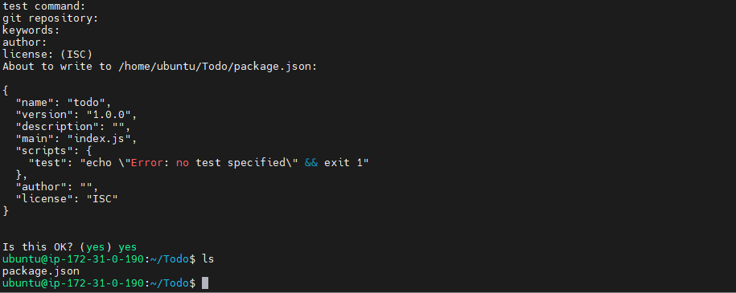
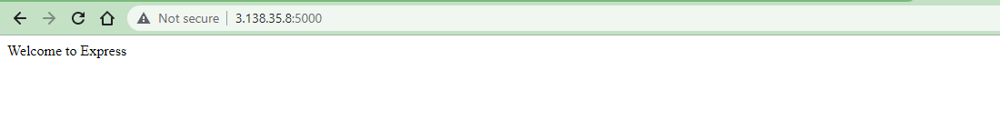

# MERN STACK IMPLEMENTATION

### MERN (MongoDB, ExpressJS, ReactJS, NodeJS)- It consists of following components:
- MongoDB: A document-based, No-SQL database used to store application data in a form of documents.
- ExpressJS: A server side Web Application framework for Node.js.
- ReactJS: A frontend framework developed by Facebook. It is based on JavaScript, used to build User Interface (UI) components.
- Node.js: A JavaScript runtime environment. It is used to run JavaScript on a machine rather than in a browser.

*MERN Architecture*

#### Step 0 – Spun-off EC2 Linux Ubuntu Server and Applied basic configurations

Launched EC2 instance of Linux Ubuntu Server 20.04 LTS (HVM) and named it as pbl_p3_mern. Created security group with relevant ports opened and also created and saved my private key to be used for SSH into the EC2 instance.

*EC2 Instance Linux Ubuntu Server 20.04 1 CPU 8G Storage*

### Step 1: Backend Configuration:

update and upgrade Ubuntu
`sudo apt update && sudo apt upgrade`

Lets get the location of Node.js software from Ubuntu repositories.

get the location of Node.js software from Ubuntu repositories

`curl -sL https://deb.nodesource.com/setup_12.x | sudo -E bash`

Install Node.js on the server 

`sudo apt-get install -y nodejs`

Verify the node installation with the command below

`node -v && npm -v`

Create "Todo" directory and initialise the project using npm init, so that a new file named package.json will be created.

`mkdir Todo`

`npm init`

*Todo/package.json*

Install expressjs

`npm install express`

Install the dotenv module

`npm install dotenv `

write the following codes in index.js file

`const express = require('express');`
`require('dotenv').config();`

`const app = express();`

`const port = process.env.PORT || 5000;`

`app.use((req, res, next) => {`
`res.header("Access-Control-Allow-Origin", "\*");`
`res.header("Access-Control-Allow-Headers", "Origin, ``X-Requested-With, Content-Type, Accept");`
`next();`
`});`

`app.use((req, res, next) => {`
`res.send('Welcome to Express');`
`});`

`app.listen(port, () => {`
`console.log(`Server running on port ${port}`)`
`});`

Notice that we have opted to use port 5000 in the code.

Start the server in the backend using

` node index.js`

*Express server installed at backend*

Creating routes for the app to create new tasks, display created tasks and delete completed tasks.

Creating models to house the database. We would be using MongoDB, a NoSQL database. To create the needed schema, we installed mongoose in our Todo directory, which is a Node.js package that makes working with mongodb easier.

`npm install mongoose`

We input the following codes in the todo.js file in models directory

`const mongoose = require('mongoose');`
`const Schema = mongoose.Schema;`

`//create schema for todo`
`const TodoSchema = new Schema({`
`action: {`
`type: String,`
`required: [true, 'The todo text field is required']`
`}`
`})`

`//create model for todo`
`const Todo = mongoose.model('todo', TodoSchema);`

`module.exports = Todo;`

MongoDB:
Created MongoDB database and obtained the database connection string which is made up of the database username, password and database endpoints. The connection string is included in the .env variable.

*Cluster 0 of MongoDB*

Step 2 – Frontend creation